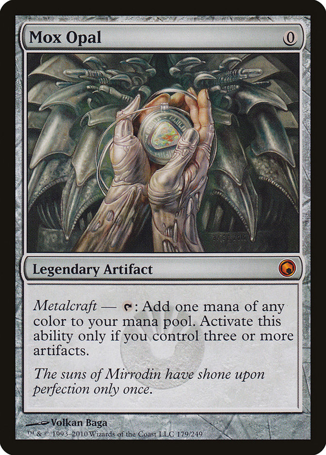
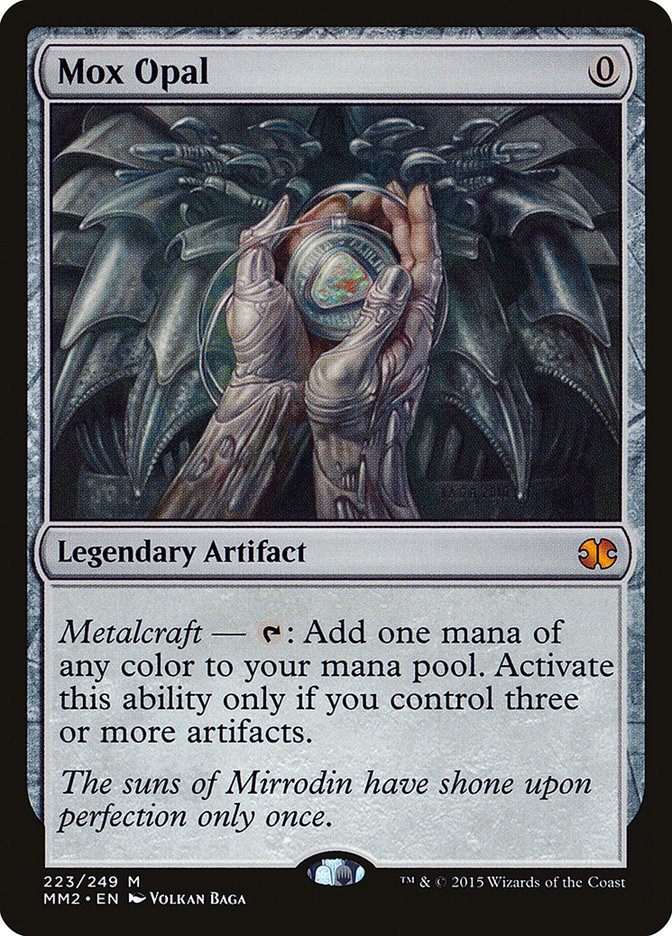

<style>
.figure-container {
  display: flex; 
  align-items: center; 
  flex-direction:column; 
  margin: 0 auto; 
  width: 70%; 
  text-align: center;
}

.images {
  display: flex;
  justify-content: center;
  margin-bottom: 10px;
}

.images > *:not(:last-child) {
  margin-right: 15px;
}

.images > img {
  height: 350px;
}
</style>

# Сложные запросы

## Preface

В _Magic: The Gathering_, как в бумажной коллекционной карточной
игре с обилием форматов, которые включают в себя не только
ротирующийся (постоянно меняющийся) _Standard_, в котором можно
играть только картами из сетов за последние два года, а ещё и
"вечные" форматы вроде _Modern_ или _Legacy_, возникает
необходимость в _репринтах_ некоторых карт. Так как у игры есть
процветающий вторичный рынок карт, цены на отдельные карты в
вечных форматах могут достигать действительно больших значений.
Репринты помогают контролировать цены на такие карты, фактически
увеличивая их предложение на рынке.

Таким образом, _репринт_ &mdash; это переиздание карты, которая
уже существовала в игре, в новом сете.

<div class='figure-container'>
  <div class='images'>
    
    
  </div>
  <i>Карта "Опаловый Мокс": её оригинальное издание из Scars of
  Mirrodin и репринт в Modern Masters 2015</i>
</div>


1. Выборка трёхсимвольного кода, имени, даты выпуска, мира
   и количества репринтов во всех сетах, в которых есть хотя бы
   один и которые легальны в заданном формате, отсортированных по
   убыванию по количеству репринтов в этих сетах.

   Необходимость: поиск сетов с самым большим количеством
   репринтов.

   Код запроса:

   ```sql
   with recent_legal_sets as (select s.id, s.code, s.name, s.release_date, s.size, s.plane from sets s
     join sets_formats_relation rf on (rf.set_id = s.id)
     join formats f on (rf.format_id = f.id)
     where s.release_date between '__START_DATE__' and '__END_DATE__'
     and f.name = '__FORMAT__'),
   print_count as (select rs.card_id, count(rs.card_id) as times_printed from sets_cards_relation rs
     group by rs.card_id),
   set_reprint_count as (select rls.id, count(rls.id) as reprint_count from recent_legal_sets rls
     join sets_cards_relation rs on (rs.set_id = rls.id)
     join print_count pc on (rs.card_id = pc.card_id
       and exists (select 1 from sets_cards_relation rs where rs.card_id = pc.card_id and rs.set_id = rls.id))
     where pc.times_printed > 1
     group by rls.id)
   select rls.code, rls.name, rls.release_date, src.reprint_count, p.name as plane from recent_legal_sets rls
   join planes p on (rls.plane = p.id)
   join set_reprint_count src on (rls.id = src.id)
   order by src.reprint_count desc;
   ```

   Доступные параметры:\
   `__START_DATE__` &mdash; дата начала промежутка времени, в
   котором происходит поиск сетов\
   `__END_DATE__` &mdash; дата конца промежутка времени, в котором
   происходит поиск сетов, для применения оптимизации между этими
   двумя датами должен быть сравнительно небольшой промежуток
   времени\
   `__FORMAT__` &mdash; формат, в котором должны быть легальны сеты,
   поиск которых осуществляется
   - `'Standard'`
   - `'Modern'`
   - `'Legacy'`
   - `'EDH'`
   - `'Pauper'`
   - `'Vintage'`

   Оптимизация была необходима по дате выпуска для облегчения
   поиска по промежутку дат.

   ```sql
   create index sets_release_date_index on public.sets (release_date asc);
   ```
2. Выборка имени, мана-стоимости, типа (линии типов), текста, 
   редкости и суммарного количества изданий во всех сетах каждого
   репринта, присутствующего в заданном сете.

   Необходимость: поиск всех репринтов в конкретном сете.

   Код запроса:

   ```sql
   with set_id as (select s.id as set_id from sets s where lower(s.code) = lower('__CODE__')),
   set_cards as (select rs.card_id as id, sid.set_id from sets_cards_relation rs
     join set_id sid on (rs.set_id = sid.set_id)),
   total_print_count as (select rs.card_id, count(rs.card_id) as print_count from sets_cards_relation rs
     where rs.card_id in (select id from set_cards)
     group by rs.card_id)
   select c.name, c.mana, c.type, c.oracle, c.rarity, tpc.print_count as total_prints from cards c
   join set_cards sc on (c.id = sc.id
     and exists (select 1 from sets_cards_relation rs where rs.card_id = sc.id 
       and rs.set_id <> sc.set_id))
   join total_print_count tpc on (c.id = tpc.card_id)
   ```

   Доступный параметр: `__CODE__` &mdash; трёхсимвольный код сета
   - `'DOM'`
   - `'ktk'`
   - `'som'`
   - `'DTK'`

   Оптимизация была необходима по трёхсимвольному коду сета, чтобы
   последовательное сканирование в поисках доступного сета не
   занимало бы много времени.

   ```sql 
   create index set_code_index on public.sets (lower(code));
   ```
3. Выборка имени, количества переизданий и форматов (среди больших),
   в которых играет карта, всех карт из сетов, легальных в "больших"
   форматах, имеющих конвертированную мана-стоимость
   больше заданного числа, отсортированных по количеству
   переизданий.\
   Большим форматом считается такой, в котором легально больше
   `__SET_COUNT__` сетов.

   Необходимость: получение информации о самых частых "целях"
   репринтов &mdash; обычно это карты, которые являются "стейплами"
   во многих форматах сразу, то есть очень часто играемыми картами.

   Код запроса:

   ```sql
   with phat_relation as (select f.name as format_name, c.name from cards c
     join sets_cards_relation csr on (c.id = csr.card_id)
     join sets_formats_relation fsr on (csr.set_id = fsr.set_id)
     join formats f on (fsr.format_id = f.id)
     where calculate_cmc(c.mana) > __CMC__),
   formats_with_sets_amount as (select f.name, fr.format_id, count(f.name) as set_count from sets_formats_relation fr
     join formats f on (fr.format_id = f.id)
     group by f.name, fr.format_id having count(f.name) >      __SET_COUNT__),
   print_count as (select pr.name, count(pr.name) as print_count from phat_relation pr group by pr.name), 
   distinct_formats as (select distinct pr.name, pr.format_name, pc.print_count from phat_relation pr
     join print_count pc on (pr.name = pc.name))
   select df.name, count(df.name), array_agg(df.format_name) from distinct_formats df
   group by df.name order by count(df.name) desc;
   ```

   Доступные параметры:\
   `__CMC__` &mdash; значение конвертированной мана-стоимости, по
   которому будут отбираться карты, имеющие большую CMC.
   - 7
   - 8
  
   `__SET_COUNT__` &mdash; количество легальных сетов, по
   превышении которого формат будет считаться "большим".
   - 650
   - 670


   Оптимизация была необходима по значению конвертированной
   мана-стоимости, чтобы упростить фильтрацию карт по её значению.

   ```sql
   create index cards_cmc_asc_index on public.cards (calculate_cmc(mana) asc nulls first);
   ```