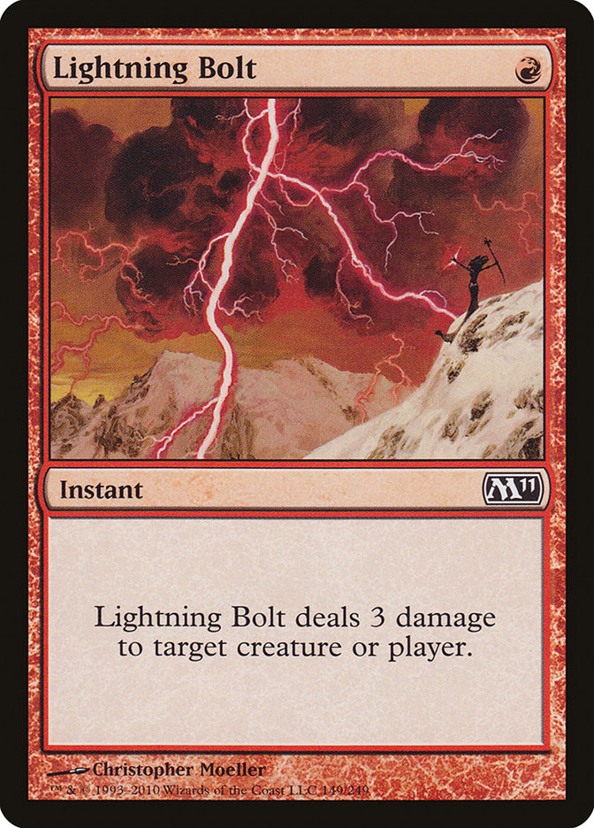
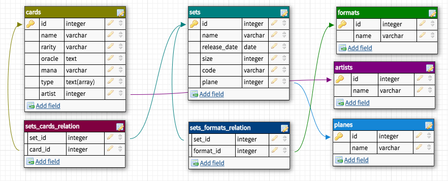

# Magic Cards

## Abstract

В коллекционной карточной игре _Magic: The Gathering_, существующей
с 1993 года, насчитывается уже больше 30 тысяч уникальных карт.
Игрокам необходимо делать колоды, легальные в разных форматах
игры, используя карты за всю 25-летнюю историю Магии, которые были
выпущены в более чем 79 сетах.

  
  <i>Рис.1</i> Lightning Bolt, одна из самых известных карт Magic.
  В правом верхнем углу указана мано-стоимость (в данном случае
  равная {R}), снизу от изображения художника указан тип карты,
  (в данном случае это Instant), затем идёт текст карты.

Такое обилие карт призывает игроков делать системы катологизации
и поиска карт по разным параметрам. Действительно, пространства для
действий здесь и вправду очень много: у карт очень много разных
параметров, да и самих их прилично. Такие системы уже существуют
(я, являясь игроком сам, предпочитаю Scryfall), но для этого
учебного проекта я решил сделать БД, которая могла бы использоваться
в подобной системе.

## Entities

- **Карты**. Карты являются сердцем и душой _Magic: The Gathering_.
  Карты можно охарактеризовать следующими свойствами:

  1. Название
  2. Мана-стоимость
  3. Тип (линия типов) карты. Каждая карта в игре имеет свой тип.
     Основных типов карт 7: Creature, Instant, Sorcery, Enchantment,
     Artifact, Land, Planeswalker. Кроме того, у карты может быть
     супертип (e.g. Legendary, Tribal) и подтипы (обычно
     обозначающие диспозицию существа в мире игры, например,
     Human Monk, Merfolk Warrior, Faerie Wizard etc.)
  4. Oracle Text карты. По-простому, это просто текст. Однако из-за
     того, что карты являются бумажными, а не цифровыми, возможности
     перепечатывать их нет, поэтому при внесении какой-либо эрраты
     в текст карт изменяется именно их oracle text. Поэтому в общем
     случае oracle text отличается от реального текста карты. Однако
     так как это единственный источник правды для судей на турнирах,
     использовать в БД мы будем именно его.
  5. Редкость карты. Может быть Common, Uncommon, Rare и Mythic
     Rare, а так же Timeshifted.
  6. Художник, рисовавший изображение к карте.

- **Сеты**. Сет объединяет собой несколько (обычно много) карт.
  Его можно охарактеризовать следующими свойствами:

  1. Название
  2. Дата выпуска
  3. Размер (указанный в количестве карт, входящих в него)
  4. Трёхсимвольный код сета, являющийся уникальным, например,
  у сета Innistrad этот код равен ISD.
  5. Мир (или Plane), являющийся сеттингом для сета. В Магии есть
  множество уникальных миров, являющихся тематикой для сета,
  например, Равника, Иннистрад, Мирродин, Доминария, Амонхет и
  прочие.

- **Форматы**. Формат это, говоря обще, набор карт (или правил,
  по которым эти карты выбираются), которыми можно играть в рамках
  этого формата. Например, в формате Standard можно играть картами
  всех сетов, выпущенных за последние два года. В Modern можно
  играть сетами, выпущенными после Eighth Edition включительно.
- **Художники**.
- **Миры**.

## DB Structure

В БД есть следующие таблицы (семантическую суть полей я описал
выше):

### cards
Поля:
- `id` &mdash; `integer`
- `name` &mdash; `character varying(50)`
- `rarity` &mdash; `character varying(15)`
- `oracle` &mdash; `text`
- `mana` &mdash; `character varying(10)`
- `type` &mdash; `text[]`
- `artist` &mdash; `integer`, ссылается на таблицу `artists`

### sets
Поля:
- `id` &mdash; `integer`
- `name` &mdash; `character varying(50)`
- `release_date` &mdash; `date`
- `size` &mdash; `integer`
- `code` &mdash; `character varying(3)`
- `plane` &mdash; `integer`, ссылается на таблицу `planes`

### formats
Поля:
- `id` &mdash; `integer`
- `name` &mdash; `character varying(50)`

### artists
Поля:
- `id` &mdash; `integer`
- `name` &mdash; `character varying(70)`

### planes
Поля:
- `id` &mdash; `integer`
- `name` &mdash; `character varying(70)`

### sets_cards_relation
Таблица для m:m связи между таблицами `sets` и `cards`.\
Поля:
- `set_id` &mdash; `integer`
- `card_id` &mdash; `integer`
  
### sets_formats_relation
Таблица для m:m связи между таблицами `sets` и `formats`.\
Поля:
- `set_id` &mdash; `integer`
- `format_id` &mdash; `integer`

 
 
 
 
 

## Relations

  
  <i>Рис. 2</i> База данных, как она выглядит в DBDesigner.

1. Между таблицами `cards` и `artists` существует 1:m связь, так как
   у одного художника может быть несколько карт, над иллюстрациями
   к которым он работал.
2. Между таблицами `sets` и `planes` существует 1:m связь, так как
   у каждого мира может быть несколько сетов, которые использовали
   его в качестве основного сеттинга.
3. Между таблицами `cards` и `sets` существует m:m связь, так как
   в каждом сете много карт, и помимо этого, каждая карта может
   иметь репринт в нескольких сетах.
4. Между таблицами `sets` и `formats` существует m:m связь, так как
   каждый сет может быть одновременно легален в нескольких форматах,
   и при этом в каждом формате обычно легально множество сетов. На
   самом деле, эта модель является несколько упрощённой для этого
   учебного проекта, так как на самом деле легальность в формате
   не всегда определяется только принадлежностью к сету. Во-первых,
   в каждом формате есть свой бан-лист, карты из которого должны
   быть легальны, но были сочтены ломающими баланс формата и поэтому
   легальными не являющимися. Помимо этого, например, в формате
   Pauper легальны все карты обычной (common) редкости, а в
   Penny Dreadful легальны только карты из сетов текущей
   Standard-ротации, но которые стоят меньше 0.01 tix в Magic
   Online. Однако для учебной задачи эта модель подойдёт.

