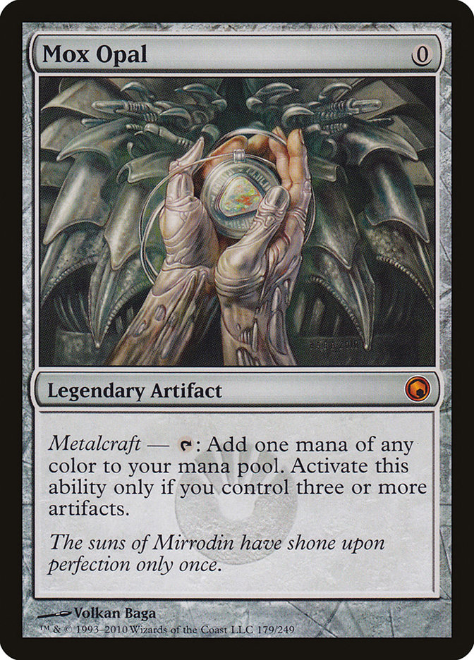

<style>
.figure-container {
  display: flex; 
  align-items: center; 
  flex-direction:column; 
  margin: 0 auto; 
  width: 70%; 
  text-align: center;
}

.images {
  display: flex;
  justify-content: center;
  margin-bottom: 10px;
}

.images > *:not(:last-child) {
  margin-right: 15px;
}

.images > img {
  height: 350px;
}

.full-page {
  height: 100vh;
}

.title-page {
  display: grid;
  height: 100%;
  grid-template-rows: repeat(20, 5%);
  grid-template-columns: 100%;
}

.title-page > * {
  text-align: center;
}

.university {
  grid-row: 1 / span 2;
  font-size: 18px;
}

.project-name {
  grid-row: 7 / span 5;
  font-size: 40px;
}

.completed-by {
  font-size: 20px;
  grid-row: 18 / 19; 
}

.city {
  grid-row: 19 / 20;
}

.contents {
  font-size: 20px;
}
</style>

<div class='full-page'>
  <div class='title-page'>
    <div class='university'>
      Санкт-Петербургский государственный университет
    </div>
    <div class='project-name'>
      База данных &laquo;Magic Cards&raquo;
    </div>
    <div class='completed-by'>
      Выполнил Данил Кузнецов, 203 группа
    </div>
    <div class='city'>
      Санкт-Петербург, 2018
    </div>
  </div>
</div>
<div class='full-page'>
  <h1>Содержание</h1>
  <div class='contents'>
    <ol>
      <li>Введение</li>
      <li>Сущности</li>
      <li>Структура БД</li>
      <li>Связи</li>
      <li>Лёгкие запросы</li>
      <li>Средние запросы</li>
      <li>Сложные запросы</li>
    </ol>
  </div>
</div>

# 1. Введение

В коллекционной карточной игре _Magic: The Gathering_, существующей
с 1993 года, насчитывается уже больше 30 тысяч уникальных карт.
Игрокам необходимо делать колоды, легальные в разных форматах
игры, используя карты за всю 25-летнюю историю Магии, которые были
выпущены в более чем 79 сетах.

<div class='figure-container'>
  <div class='images'>
    
  </div>
  <i>Рис.1</i> Lightning Bolt, одна из самых известных карт Magic.
  В правом верхнем углу указана мано-стоимость (в данном случае
  равная {R}), снизу от изображения художника указан тип карты,
  (в данном случае это Instant), затем идёт текст карты.
</div>

Такое обилие карт призывает игроков делать системы катологизации
и поиска карт по разным параметрам. Действительно, пространства для
действий здесь и вправду очень много: у карт очень много разных
параметров, да и самих их прилично. Такие системы уже существуют
(я, являясь игроком сам, предпочитаю Scryfall), но для этого
учебного проекта я решил сделать БД, которая могла бы использоваться
в подобной системе.

# 2. Сущности

- **Карты**. Карты являются сердцем и душой _Magic: The Gathering_.
  Карты можно охарактеризовать следующими свойствами:

  1. Название
  2. Мана-стоимость
  3. Тип (линия типов) карты. Каждая карта в игре имеет свой тип.
     Основных типов карт 7: Creature, Instant, Sorcery, Enchantment,
     Artifact, Land, Planeswalker. Кроме того, у карты может быть
     супертип (e.g. Legendary, Tribal) и подтипы (обычно
     обозначающие диспозицию существа в мире игры, например,
     Human Monk, Merfolk Warrior, Faerie Wizard etc.)
  4. Oracle Text карты. По-простому, это просто текст. Однако из-за
     того, что карты являются бумажными, а не цифровыми, возможности
     перепечатывать их нет, поэтому при внесении какой-либо эрраты
     в текст карт изменяется именно их oracle text. Поэтому в общем
     случае oracle text отличается от реального текста карты. Однако
     так как это единственный источник правды для судей на турнирах,
     использовать в БД мы будем именно его.
  5. Редкость карты. Может быть Common, Uncommon, Rare и Mythic
     Rare, а так же Timeshifted.
  6. Художник, рисовавший изображение к карте.

- **Сеты**. Сет объединяет собой несколько (обычно много) карт.
  Его можно охарактеризовать следующими свойствами:

  1. Название
  2. Дата выпуска
  3. Размер (указанный в количестве карт, входящих в него)
  4. Трёхсимвольный код сета, являющийся уникальным, например,
  у сета Innistrad этот код равен ISD.
  5. Мир (или Plane), являющийся сеттингом для сета. В Магии есть
  множество уникальных миров, являющихся тематикой для сета,
  например, Равника, Иннистрад, Мирродин, Доминария, Амонхет и
  прочие.

- **Форматы**. Формат это, говоря обще, набор карт (или правил,
  по которым эти карты выбираются), которыми можно играть в рамках
  этого формата. Например, в формате Standard можно играть картами
  всех сетов, выпущенных за последние два года. В Modern можно
  играть сетами, выпущенными после Eighth Edition включительно.
- **Художники**.
- **Миры**.

# 3. Структура БД

В БД есть следующие таблицы (семантическую суть полей я описал
выше):

### cards
Поля:
- `id` &mdash; `integer`
- `name` &mdash; `character varying(50)`
- `rarity` &mdash; `character varying(15)`
- `oracle` &mdash; `text`
- `mana` &mdash; `character varying(10)`
- `type` &mdash; `text[]`
- `artist` &mdash; `integer`, ссылается на таблицу `artists`

### sets
Поля:
- `id` &mdash; `integer`
- `name` &mdash; `character varying(50)`
- `release_date` &mdash; `date`
- `size` &mdash; `integer`
- `code` &mdash; `character varying(3)`
- `plane` &mdash; `integer`, ссылается на таблицу `planes`

### formats
Поля:
- `id` &mdash; `integer`
- `name` &mdash; `character varying(50)`

### artists
Поля:
- `id` &mdash; `integer`
- `name` &mdash; `character varying(70)`

### planes
Поля:
- `id` &mdash; `integer`
- `name` &mdash; `character varying(70)`

### sets_cards_relation
Таблица для m:m связи между таблицами `sets` и `cards`.\
Поля:
- `set_id` &mdash; `integer`
- `card_id` &mdash; `integer`
  
### sets_formats_relation
Таблица для m:m связи между таблицами `sets` и `formats`.\
Поля:
- `set_id` &mdash; `integer`
- `format_id` &mdash; `integer`

<br />
<br />
<br />
<br />
<br />

# 4. Связи

<div style='display: flex; align-items:center; flex-direction:column; margin: 0 auto; width: 95%; text-align: center;'>
  
  <i>Рис. 2</i> База данных, как она выглядит в DBDesigner.
</div>

1. Между таблицами `cards` и `artists` существует 1:m связь, так как
   у одного художника может быть несколько карт, над иллюстрациями
   к которым он работал.
2. Между таблицами `sets` и `planes` существует 1:m связь, так как
   у каждого мира может быть несколько сетов, которые использовали
   его в качестве основного сеттинга.
3. Между таблицами `cards` и `sets` существует m:m связь, так как
   в каждом сете много карт, и помимо этого, каждая карта может
   иметь репринт в нескольких сетах.
4. Между таблицами `sets` и `formats` существует m:m связь, так как
   каждый сет может быть одновременно легален в нескольких форматах,
   и при этом в каждом формате обычно легально множество сетов. На
   самом деле, эта модель является несколько упрощённой для этого
   учебного проекта, так как на самом деле легальность в формате
   не всегда определяется только принадлежностью к сету. Во-первых,
   в каждом формате есть свой бан-лист, карты из которого должны
   быть легальны, но были сочтены ломающими баланс формата и поэтому
   легальными не являющимися. Помимо этого, например, в формате
   Pauper легальны все карты обычной (common) редкости, а в
   Penny Dreadful легальны только карты из сетов текущей
   Standard-ротации, но которые стоят меньше 0.01 tix в Magic
   Online. Однако для учебной задачи эта модель подойдёт.

# 5. Лёгкие запросы

1. Выборка всех строк из таблицы `cards`, у которых имя содержит
   заданный параметр. Обратите внимание, что мы используем
   сравнение на partial match через оператор `like`, потому что
   на фронтенде приложения для обращения к базе данных пользователь
   скорее всего будет искать карту только по части её названия,
   например, Azusa вместо Azusa, Lost but Seeking, просто Bolt
   вместо Lightning Bolt, Cryptic вместо Cryptic Command и так
   далее.

   Необходимость: поиск карты по частичному совпадению имени.

   Код запроса:

   ```sql
   select * from public.cards c where c.name like '%__NAME__%';
   ```

   Допустимый параметр: `__NAME__`:
   - `'Azusa'`
   - `'Bolt'`
   - `'Path to Exile'`

   Оптимизация:

   ```sql
   create index cards_name_index on public.cards using gin (name public.gin_trgm_ops);
   ```

2. Выборка типов редкости и количества карт, сгрупированных по типу
   редкости, имеющих тип `__TYPE__`.

   Необходимость: статистическое распределение карт по их типам.

   Код запроса:

   ```sql
   select c.rarity, count(*) from public.cards c where c.type @> array['__TYPE__'] group by c.rarity;
   ```

   Допустимый параметр: `__TYPE__`, тип, который должен входить
   в строку типов карты:
   - `'Legendary'`
   - `'Monk'`
   - `'Eldrazi'`
   - `'Angel'`

   Оптимизация:

   ```sql
   create index cards_typeline_index on public.cards using gin (type);
   ```

3. Выборка всех строк карт, имеющих тип `__TYPE__ ` и
   конвертированную мана-стоимость больше `__CMC__`.

   Необходимость: поиск карт, имеющих заданный тип и с наложенными
   на конвертированную мана-стоимость ограничениями.

   Код запроса:

   ```sql
   select * from public.cards c where public.calculate_cmc(c.mana) > __CMC__ and c.type @> array['__TYPE__'];
   ```

   Допустиые параметры:
   `__TYPE__`, тип, который должен входить в строку типов карты:
   - `'Creature'`
   - `'Demon'`
   - `'Horror'`
   - `'Wizard'`
  
   `__CMC__`, конвертированная мана-стоимость карты:
   - `3`
   - `5`

   Оптимизация:
   
   ```sql
   create index cards_typeline_index on public.cards using gin (type);
   ```

   Помимо этого, если убрать фильтр по типам из запроса, то
   планировщик будет использовать индекс по значению
   конвертированной мана-стоимости:

   ```sql
   create index cards_cmc_asc_index on public.cards (calculate_cmc(mana) asc nulls first);
   ```
4. Выборка 5 строк сетов, отсортированных по дате выхода по
   возрастанию.

   Необходимость: получение информации о первых сетах игры.

   Код запроса:

   ```sql
   select * from public.sets s order by s.release_date limit 5;
   ```

   Допустимые параметры: (нет)

   Оптимизация:

   ```sql
   create index sets_order_index on public.sets (release_date asc);
   ```

# 6. Средние запросы

1. Выборка всех карт, которые присутствуют в сете с трёхсимвольным
   кодом `__CODE__`, отсортированных по конвертированной
   мана-стоимости.
   
   Необходимость: поиск карт из конкретного сета.

   Код запроса: 

   ```sql
   select c.name, c.rarity, c.oracle, c.mana, c.type, s.code from public.cards c 
   join public.sets_cards_relation r on (c.id = r.card_id) 
   join public.sets s on (r.set_id = s.id)
   where lower(s.code) = '__CODE__'
   order by public.calculate_cmc(c.mana) asc nulls first;
   ```

   Доступный параметр: `__CODE__` &mdash; трёхсимвольный код сета:
   - `'KTK'`
   - `'DTK'`
   - `'SOM'`
   - `'ISD'`

   Оптимизация была необходима по трёхсимвольному коду сета, чтобы
   последовательное сканирование в поисках доступного сета не
   занимало бы много времени.

   ```sql 
   create index set_code_index on public.sets (lower(code));
   ```
2. Выборка всех сетов, выпущенных с `__START_DATE__` по
   `__END_DATE__`, имеющих мир `__PLANE__` сеттингом,
   отсортированных по возрастанию даты выпуска.

   Необходимость: получение информации о сетах, события которых
   происходят в заданном мире, выпущенных в конкретное время, дабы,
   например, получить только новые сеты с этим миром.

   Код запроса:

   ```sql
   select s.name, s.code, s.release_date, s.size from public.sets s
   join public.planes p on (s.plane = p.id)
   where s.release_date between '__START_DATE__'::date and '__END_DATE__'::date and p.name = '__PLANE__'
   order by release_date asc;
   ```

   Доступные параметры:\
   `__START_DATE__` &mdash; дата начала промежутка времени, в
   котором происходит поиск сетов\
   `__END_DATE__` &mdash; дата конца промежутка времени, в котором
   происходит поиск сетов\
   `__PLANE__` &mdash; мир сеттинга сета
   - `'Ravnica'`
   - `'Innistrad'`
   - `'Mirrodin'`
  
   Оптимизация была необходима по дате выпуска для облегчения
   сортировки и поиска по промежутку дат.

   ```sql
   create index sets_release_date_index on public.sets (release_date asc);
   ```
3. Выборка всех карт, иллюстрация к которым была сделана художником
   `__ARTIST__` и имеющих тип `__TYPE__`.

   Необходимость: поиск карт конкретного типа, нарисованных одним
   художником, например, всех артефактов от Volkan Baga.

   Код запроса:

   ```sql
   select c.name, c.rarity, c.oracle, c.mana, c.type, a.name as artist_name
   from public.cards c
   join public.artists a on (c.artist = a.id)
   where a.name = '__ARTIST__'
   and c.type @> array['__TYPE__'];
   ```

   Доступные параметры:\
   `__ARTIST__` &mdash; художник
   - `'Volkan Baga'`
   - `'Chippy'`

   `__TYPE__` &mdash; тип, который должен быть на карте
   - `'Artifact'`
   - `'Merfolk'`
   - `'Legendary'`

   Оптимизация нужна по типу карты, чтобы упростить этот поиск.

   ```sql
   create index cards_typeline_index on public.cards using gin (type);
   ```

<br />
<br />
<br />
<br />
<br />
<br />
<br />
<br />
<br />
<br />

# 7. Сложные запросы

## Preface

В _Magic: The Gathering_, как в бумажной коллекционной карточной
игре с обилием форматов, которые включают в себя не только
ротирующийся (постоянно меняющийся) _Standard_, в котором можно
играть только картами из сетов за последние два года, а ещё и
"вечные" форматы вроде _Modern_ или _Legacy_, возникает
необходимость в _репринтах_ некоторых карт. Так как у игры есть
процветающий вторичный рынок карт, цены на отдельные карты в
вечных форматах могут достигать действительно больших значений.
Репринты помогают контролировать цены на такие карты, фактически
увеличивая их предложение на рынке.

Таким образом, _репринт_ &mdash; это переиздание карты, которая
уже существовала в игре, в новом сете.

<div class='figure-container'>
  <div class='images'>
    
    
  </div>
  <i>Карта "Опаловый Мокс": её оригинальное издание из Scars of
  Mirrodin и репринт в Modern Masters 2015</i>
</div>


1. Выборка трёхсимвольного кода, имени, даты выпуска, мира
   и количества репринтов во всех сетах, в которых есть хотя бы
   один и которые легальны в заданном формате, отсортированных по
   убыванию по количеству репринтов в этих сетах.

   Необходимость: поиск сетов с самым большим количеством
   репринтов.

   Код запроса:

   ```sql
   with recent_legal_sets as (select s.id, s.code, s.name, s.release_date, s.size, s.plane from sets s
     join sets_formats_relation rf on (rf.set_id = s.id)
     join formats f on (rf.format_id = f.id)
     where s.release_date between '__START_DATE__' and '__END_DATE__'
     and f.name = '__FORMAT__'),
   print_count as (select rs.card_id, count(rs.card_id) as times_printed from sets_cards_relation rs
     group by rs.card_id),
   set_reprint_count as (select rls.id, count(rls.id) as reprint_count from recent_legal_sets rls
     join sets_cards_relation rs on (rs.set_id = rls.id)
     join print_count pc on (rs.card_id = pc.card_id
       and exists (select 1 from sets_cards_relation rs where rs.card_id = pc.card_id and rs.set_id = rls.id))
     where pc.times_printed > 1
     group by rls.id)
   select rls.code, rls.name, rls.release_date, src.reprint_count, p.name as plane from recent_legal_sets rls
   join planes p on (rls.plane = p.id)
   join set_reprint_count src on (rls.id = src.id)
   order by src.reprint_count desc;
   ```

   Доступные параметры:\
   `__START_DATE__` &mdash; дата начала промежутка времени, в
   котором происходит поиск сетов\
   `__END_DATE__` &mdash; дата конца промежутка времени, в котором
   происходит поиск сетов, для применения оптимизации между этими
   двумя датами должен быть сравнительно небольшой промежуток
   времени\
   `__FORMAT__` &mdash; формат, в котором должны быть легальны сеты,
   поиск которых осуществляется
   - `'Standard'`
   - `'Modern'`
   - `'Legacy'`
   - `'EDH'`
   - `'Pauper'`
   - `'Vintage'`

   Оптимизация была необходима по дате выпуска для облегчения
   поиска по промежутку дат.

   ```sql
   create index sets_release_date_index on public.sets (release_date asc);
   ```
2. Выборка имени, мана-стоимости, типа (линии типов), текста, 
   редкости и суммарного количества изданий во всех сетах каждого
   репринта, присутствующего в заданном сете.

   Необходимость: поиск всех репринтов в конкретном сете.

   Код запроса:

   ```sql
   with set_id as (select s.id as set_id from sets s where lower(s.code) = lower('__CODE__')),
   set_cards as (select rs.card_id as id, sid.set_id from sets_cards_relation rs
     join set_id sid on (rs.set_id = sid.set_id)),
   total_print_count as (select rs.card_id, count(rs.card_id) as print_count from sets_cards_relation rs
     where rs.card_id in (select id from set_cards)
     group by rs.card_id)
   select c.name, c.mana, c.type, c.oracle, c.rarity, tpc.print_count as total_prints from cards c
   join set_cards sc on (c.id = sc.id
     and exists (select 1 from sets_cards_relation rs where rs.card_id = sc.id 
       and rs.set_id <> sc.set_id))
   join total_print_count tpc on (c.id = tpc.card_id)
   ```

   Доступный параметр: `__CODE__` &mdash; трёхсимвольный код сета
   - `'DOM'`
   - `'ktk'`
   - `'som'`
   - `'DTK'`

   Оптимизация была необходима по трёхсимвольному коду сета, чтобы
   последовательное сканирование в поисках доступного сета не
   занимало бы много времени.

   ```sql 
   create index set_code_index on public.sets (lower(code));
   ```
3. Выборка имени, количества переизданий и форматов (среди больших),
   в которых играет карта, всех карт из сетов, легальных в "больших"
   форматах, имеющих конвертированную мана-стоимость
   больше заданного числа, отсортированных по количеству
   переизданий.\
   Большим форматом считается такой, в котором легально больше
   `__SET_COUNT__` сетов.

   Необходимость: получение информации о самых частых "целях"
   репринтов &mdash; обычно это карты, которые являются "стейплами"
   во многих форматах сразу, то есть очень часто играемыми картами.

   Код запроса:

   ```sql
   with phat_relation as (select f.name as format_name, c.name from cards c
     join sets_cards_relation csr on (c.id = csr.card_id)
     join sets_formats_relation fsr on (csr.set_id = fsr.set_id)
     join formats f on (fsr.format_id = f.id)
     where calculate_cmc(c.mana) > __CMC__),
   formats_with_sets_amount as (select f.name, fr.format_id, count(f.name) as set_count from sets_formats_relation fr
     join formats f on (fr.format_id = f.id)
     group by f.name, fr.format_id having count(f.name) >      __SET_COUNT__),
   print_count as (select pr.name, count(pr.name) as print_count from phat_relation pr group by pr.name), 
   distinct_formats as (select distinct pr.name, pr.format_name, pc.print_count from phat_relation pr
     join print_count pc on (pr.name = pc.name))
   select df.name, count(df.name), array_agg(df.format_name) from distinct_formats df
   group by df.name order by count(df.name) desc;
   ```

   Доступные параметры:\
   `__CMC__` &mdash; значение конвертированной мана-стоимости, по
   которому будут отбираться карты, имеющие большую CMC.
   - 7
   - 8
  
   `__SET_COUNT__` &mdash; количество легальных сетов, по
   превышении которого формат будет считаться "большим".
   - 650
   - 670


   Оптимизация была необходима по значению конвертированной
   мана-стоимости, чтобы упростить фильтрацию карт по её значению.

   ```sql
   create index cards_cmc_asc_index on public.cards (calculate_cmc(mana) asc nulls first);
   ```